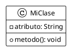

# Integración GraphViz + PlantUML

Este documento describe la integración de GraphViz y PlantUML en el proyecto.

## ✅ Instalación Completada

### GraphViz (openSUSE Leap 15.6)
GraphViz ya está instalado y funcional en tu sistema:
```bash
dot -V
# Output: dot - graphviz version 2.48.0 (0)
```

### PlantUML
PlantUML se ha integrado en el proyecto mediante el plugin de Maven.

## 📁 Estructura del Proyecto

```
Seminario_Integrador_2025/
├── docs/
│   └── diagrams/
│       ├── architecture.puml          # Diagrama de arquitectura
│       ├── class-diagram.puml         # Diagrama de clases
│       ├── sequence-login.puml        # Diagrama de secuencia
│       ├── use-case.puml             # Diagrama de casos de uso
│       ├── generated/                # Diagramas PNG generados
│       └── README.md                 # Documentación de diagramas
├── pasantias/
│   └── pom.xml                       # Plugin PlantUML configurado
└── generate-diagrams.sh              # Script de generación
```

## 🚀 Uso Rápido

### Generar todos los diagramas

```bash
./generate-diagrams.sh
```

Este script:
1. ✓ Verifica que GraphViz esté instalado
2. ✓ Genera diagramas usando Maven
3. ✓ Crea archivos PNG en `docs/diagrams/generated/`

### Resultados

Se generaron 4 diagramas:
- **Arquitectura del Sistema** (39 KB)
- **Diagrama de Clases** (48 KB)
- **Secuencia de Login** (51 KB)
- **Casos de Uso** (90 KB)

## 📝 Crear Nuevos Diagramas

1. Crea un archivo `.puml` en `docs/diagrams/`:

```bash
nano docs/diagrams/mi-diagrama.puml
```

2. Escribe tu diagrama PlantUML:



3. Genera el diagrama:

```bash
./generate-diagrams.sh
```

## 🔧 Métodos de Generación

### 1. Script automatizado (Recomendado)
```bash
./generate-diagrams.sh
```

### 2. Maven directamente
```bash
cd pasantias
mvn plantuml:generate
```

### 3. Manual con JAR
```bash
java -jar plantuml.jar docs/diagrams/*.puml -o generated
```

## 🎨 Tipos de Diagramas Soportados

PlantUML soporta múltiples tipos de diagramas UML:

- **Diagramas de Secuencia**
- **Diagramas de Casos de Uso**
- **Diagramas de Clases**
- **Diagramas de Actividad**
- **Diagramas de Componentes**
- **Diagramas de Estado**
- **Diagramas de Despliegue**
- **Diagramas de Objetos**
- **Diagramas ER**

## 📦 Configuración Maven

El archivo `pom.xml` incluye el plugin PlantUML:

```xml
<plugin>
    <groupId>com.github.funthomas424242</groupId>
    <artifactId>plantuml-maven-plugin</artifactId>
    <version>1.5.2</version>
    <configuration>
        <sourceFiles>
            <directory>${basedir}/../docs/diagrams</directory>
            <includes>
                <include>**/*.puml</include>
            </includes>
        </sourceFiles>
        <outputDirectory>${basedir}/../docs/diagrams/generated</outputDirectory>
        <format>png</format>
    </configuration>
</plugin>
```

## 🔍 Verificación

Para verificar que todo funciona:

```bash
# Verificar GraphViz
dot -V

# Generar diagramas
./generate-diagrams.sh

# Ver diagramas generados
ls -lh docs/diagrams/generated/
```

## 💡 Extensión VS Code (Opcional)

Para mejorar la experiencia de desarrollo, instala la extensión PlantUML:

```bash
code --install-extension jebbs.plantuml
```

Características:
- Previsualización en tiempo real (Alt+D)
- Syntax highlighting
- Autocompletado
- Exportación directa a múltiples formatos

## 📚 Documentación Adicional

- Ver `docs/diagrams/README.md` para documentación completa
- [PlantUML Official](https://plantuml.com/)
- [GraphViz Documentation](https://graphviz.org/)
- [PlantUML Language Reference](https://plantuml.com/guide)

## ✨ Ventajas de esta Integración

1. **Versionado**: Los diagramas `.puml` son texto plano, fáciles de versionar
2. **Automatización**: Generación automática con Maven
3. **Consistencia**: Mismo estilo visual en todos los diagramas
4. **Colaboración**: Fácil de revisar cambios en pull requests
5. **Documentación viva**: Los diagramas se actualizan con el código

## 🎯 Próximos Pasos

- [ ] Crear diagramas de secuencia para otros flujos importantes
- [ ] Agregar diagramas de actividad para procesos complejos
- [ ] Documentar el modelo ER de la base de datos
- [ ] Crear diagramas de despliegue con Docker
- [ ] Agregar generación automática en CI/CD

---

**Nota**: Los archivos PNG generados están en `.gitignore` por defecto. Solo se versionan los archivos fuente `.puml`.
