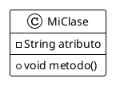

# Documentación de Diagramas UML

Este directorio contiene los diagramas UML del proyecto usando PlantUML y GraphViz.

## Estructura

```
docs/diagrams/
├── architecture.puml       # Diagrama de arquitectura del sistema
├── class-diagram.puml      # Diagrama de clases principal
├── sequence-login.puml     # Diagrama de secuencia del login
├── use-case.puml          # Diagrama de casos de uso
└── generated/             # Diagramas PNG generados
```

## Requisitos

- **GraphViz**: Motor de renderizado de gráficos
- **PlantUML**: Generador de diagramas UML
- **Java**: Para ejecutar PlantUML

### Instalación en openSUSE Leap 15.6

```bash
# Instalar GraphViz
sudo zypper install graphviz

# Verificar instalación
dot -V
```

## Generación de Diagramas

### Método 1: Usando el script (Recomendado)

Desde la raíz del proyecto:

```bash
./generate-diagrams.sh
```

### Método 2: Usando Maven

```bash
cd pasantias
mvn plantuml:generate
```

Los diagramas PNG se generarán en `docs/diagrams/generated/`

### Método 3: Manual con PlantUML JAR

```bash
# Descargar PlantUML
wget https://github.com/plantuml/plantuml/releases/download/v1.2024.8/plantuml-1.2024.8.jar

# Generar diagramas
java -jar plantuml-1.2024.8.jar docs/diagrams/*.puml -o generated
```

## Sintaxis PlantUML

### Crear un nuevo diagrama

Crea un archivo `.puml` en `docs/diagrams/`:



### Tipos de diagramas disponibles

- **Secuencia**: `@startuml` con `actor`, `participant`
- **Clases**: `class`, `interface`, `enum`
- **Casos de Uso**: `usecase`, `actor`
- **Componentes**: `component`, `package`
- **Actividad**: `start`, `stop`, `if`, `while`
- **Estado**: `state`
- **ER**: `entity`

## Integración con VS Code

Se recomienda instalar la extensión PlantUML:

```
code --install-extension jebbs.plantuml
```

Esto permite:
- Previsualización en tiempo real (Alt+D)
- Sintaxis highlighting
- Autocompletado
- Exportación directa

## Referencias

- [PlantUML Official](https://plantuml.com/)
- [GraphViz Documentation](https://graphviz.org/documentation/)
- [PlantUML Language Reference](https://plantuml.com/guide)

## Diagramas Actuales

### 1. Architecture (architecture.puml)
Muestra la arquitectura general del sistema con Frontend React, Backend Spring Boot y MySQL.

### 2. Class Diagram (class-diagram.puml)
Diagrama de clases principales: Usuario, Estudiante, Empresa, Carrera, Pasantia, Postulacion.

### 3. Sequence Login (sequence-login.puml)
Flujo de autenticación JWT desde el frontend hasta la base de datos.

### 4. Use Case (use-case.puml)
Casos de uso del sistema para Estudiantes, Empresas y Administradores.

## Personalización

### Temas disponibles

```plantuml
!theme plain
!theme bluegray
!theme cerulean
!theme superhero
!theme sketchy
```

### Colores personalizados

```plantuml
skinparam backgroundColor #FFFFFF
skinparam class {
    BackgroundColor PaleGreen
    ArrowColor SeaGreen
    BorderColor SpringGreen
}
```

## Comandos útiles

```bash
# Ver todos los archivos .puml
find docs/diagrams -name "*.puml"

# Generar solo un diagrama específico
java -jar plantuml.jar docs/diagrams/architecture.puml

# Generar en formato SVG en lugar de PNG
java -jar plantuml.jar -tsvg docs/diagrams/*.puml
```
